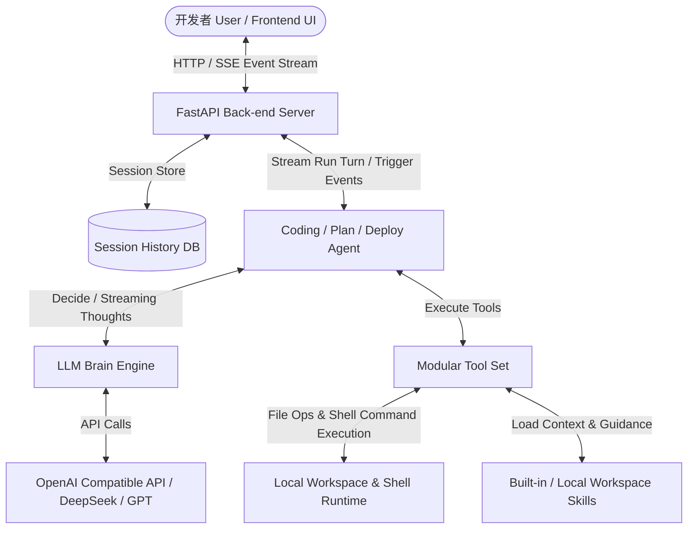

# SuperCode 🚀

<div align="center">

**Next-Generation Local Agentic Workspace & Multi-Agent Coding Copilot**

*一个下一代本地智能体工作空间与多智能体协作编码助手*

[](https://www.python.org/)
[](https://react.dev/)
[](https://fastapi.tiangolo.com/)
[](https://tailwindcss.com/)
[](LICENSE)
[](https://github.com/zongxi1115/SuperCode/pulls)

[English](#english-introduction) | [中文说明](#中文介绍)

</div>

---

## English Introduction

**SuperCode** is a local-first, developer-centric agentic codebase workspace. It decouples the core agent runtime loop from specialized domain brains, allowing orchestrating multi-agents (Planning, Coding, Deployment) to interact directly with your workspace. Featuring a beautiful modern dashboard (React 19 + Tailwind v4 + Monaco Editor), real-time SSE stream of thought, parallel read-only tools, and a directory-scoped Skill system, SuperCode brings autonomous developer capabilities directly to your desktop.

### Key Highlights
- 🧠 **Modular Multi-Agent Runtime**: Standardized executor loop supporting collaborative Brain models: `CodingAgent` (editing & tools), `PlanAgent` (planning & checklists), and `DeployAgent` (testing & packaging).
- 💬 **Interactive Visual Chat**: Real-time visualization of agent thoughts, tool calls, and results using SSE (Server-Sent Events) stream-of-thought architecture.
- ⚡ **Parallel Tool Executor**: Smart scheduler executes safe, read-only tools (like search, glob, read) in parallel using thread pools to slash execution latency.
- 🔌 **@Skill Mention Menu**: Project-scoped or global `.md` files containing instructions that the AI can dynamically load and auto-activate to handle specialized tasks.
- 🖥️ **Interactive Terminal Wait**: Built-in runtime to wait for shell outputs, command completions, or pause for user confirmation inputs safely.

---

## 中文介绍

**SuperCode** 是一个面向开发者的本地优先、高拓展性智能体开发与工作空间。项目将核心的 Agent 执环（Execution Loop）与特定场景大脑（LLM Brains）解耦，支持**规划**、**编码**、**部署**多智能体高效协同。配合精美的 React 19 + Tailwind v4 + Monaco Editor 开发者看板、SSE 实时思考流式传输、多线程只读工具并行化调度，以及独创的 `@` 技能激活系统，SuperCode 为您打造开箱即用的本地 AI 软件工程师。

### 核心亮点
- 🧠 **模块化多智能体架构**：标准化执行器基座，解耦 `agent` 与特定场景实现，包含 `CodingAgent` (编码专家)、`PlanAgent` (规划专家) 及 `DeployAgent` (部署验证专家)。
- 💬 **可视化交互看板**：前端采用 React 19 + Tailwind v4 + Monaco Editor，完美还原智能体**实时思考 (Thoughts)**、**工具调用 (Tool Calls)** 以及**终端输出 (Terminal Outputs)** 的运行轨迹。
- ⚡ **只读工具并行化**：内置智能工具调度器，支持非阻塞只读工具（如多文件搜索、文件精读）在线程池中并行执行，显著降低模型响应延迟。
- 🔌 **@Skill 提及系统**：支持在工作区目录下编写 Markdown 格式的 `SKILL.md` 规则。在提问中输入 `@` 即可手动指定激活特定技能，或由 AI 自动扫描激活对应规则。
- 🖥️ **交互式终端等待与确认**：集成了命令运行超时控制、退出状态捕获及交互式等待，在执行高危命令或需要输入时暂停并等待用户反馈。

---

## 🏛️ System Architecture / 系统架构

SuperCode combines a decoupled backend routing design with a reactive state-driven frontend:



---

## ✨ Features Breakdown / 功能特性

### 1. Unified Agent Engine / 统一的智能体引擎
The `agent/` folder acts as an abstract runner, handling chat history retention, tool parameters validation, streaming state updates, and error boundary handling. `coding_agent/`, `plan_agent/`, and `deploy_agent/` implement custom prompt brains and concrete file/terminal operation tools, making the entire framework highly pluggable.

### 2. Live SSE Streams & Parallelization / 实时思考流与并行执行
- **Streaming Output**: Through Server-Sent Events, developers can see exactly what the model is thinking, what tools are being populated, and tool response payloads concurrently.
- **Parallel Read Tools**: Tools that have `supports_parallel = True` (e.g. search, reading multiple source files) are batch executed using a `ThreadPoolExecutor`, reducing time-to-first-token.

### 3. Folder-Scoped Skills / 灵活的技能定制
You can inject specific directory contexts or coding rules into SuperCode using markdown skill files:
- **Local Skills**: Placed at `.agents/skills/<skill-name>/SKILL.md`
- **Built-in Skills**: Placed at `builtin_skills/<skill-name>/SKILL.md`
- Markdown files contain frontmatter headers like:
  ```markdown
  ---
  name: api-guidelines
  description: Coding rules and styling patterns for backend API router endpoints.
  ---
  # Guidelines Content
  ...
  ```
- Mentioning `@api-guidelines` in your chat composer tells the agent to extract and inject these rules as active system guidance for the current reasoning steps.

---

## 🚀 Quick Start / 快速启动

### Requirements / 环境依赖
- **Python**: `>= 3.10` (Anaconda recommended)
- **Node.js**: `>= 18` (PNPM package manager installed)

### 1. Configure Secrets / 配置密钥
Duplicate the environment template and configure your LLM provider details:
```powershell
copy .env.example .env
```
Open `.env` and fill in your keys:
```env
SC_AGENT_API_KEY=your-api-key
SC_AGENT_BASE_URL=https://api.openai.com/v1 # Or any compatible endpoint (DeepSeek, etc.)
SC_AGENT_MODEL=gpt-4o # Or deepseek-coder
```
*Note: If no `.env` is supplied, the backend defaults to **Demo Mode** with mock replies to simplify frontend prototyping.*

### 2. Launch / 启动服务

We provide a script to handle tool installation, Python backend setup, and React frontend bootstrap.

#### Option A: Interactive Launcher (Windows Batch)
Simply double click [start.bat](file:///d:/vibe_projs/SuperCode/start.bat) or execute it from command line:
```powershell
.\start.bat
```
Choose `2` to automatically install all dependencies and spin up both the FastAPI backend and React frontend concurrently.

#### Option B: PowerShell Quick Start
You can pass direct arguments to the PowerShell bootstrap script:
```powershell
# Activate your python environment first
conda activate base

# Installs requirements and starts both servers
powershell -ExecutionPolicy Bypass -File .\scripts\quick-start.ps1 -StartBackend -StartFrontend
```
Common options:
- `-InstallOnly`: Install backend and frontend packages without running.
- `-BackendOnly`: Setup and prepare the FastAPI workspace only.
- `-FrontendOnly`: Setup and prepare Vite React app only.
- `-AutoInstallTools`: Checks for Python/Node/PNPM and uses `winget` to install them if missing.

---

## 💻 Usage / 使用指南

### 1. Complete Web UI Experience
Once booted, navigate to `http://localhost:5173`.
- Explore local workspace file trees.
- Chat with the code assistant. Type `@` in the text area to trigger the dropdown for active markdown skills.
- Observe model thought logs, terminal standard outputs, and file diff replacements live.

### 2. Lightweight CLI Mode
If you prefer running the agent inside your command terminal:
```powershell
conda activate base
python examples/run_demo.py
```
You can type continuous queries such as:
- *“帮我看看这个 demo_workspace 是干嘛的”*
- *“那 main.py 和 helper.py 的关系是什么”*
- *“顺手给我总结成 3 点”*

---

## 🛠️ Developer SDK Integration / 开发者集成接口

You can programmatically spin up the `CodingAgent` and stream its event-driven outputs:

```python
from agent import (
    AgentLLMConfig,
    ChatSession,
    CodingAgent,
    OpenAICompatibleClient,
    AgentEvent
)
from coding_agent import CodingPromptBrain, build_coding_tools

# 1. Load config and instantiate LLM Client
config = AgentLLMConfig.from_env(".env")
client = OpenAICompatibleClient(config)

# 2. Build Agent with core Brain and workspace bindings
agent = CodingAgent(
    brain=CodingPromptBrain(client),
    tools=build_coding_tools(),
    workspace="examples/demo_workspace",
)

# 3. Create a continuous chat session
session = ChatSession(agent=agent)

# 4. Optional event listener for thought streaming and tool calls
def on_event(event: AgentEvent) -> None:
    print(f"[{event.type.upper()}] {event.message}")
    if event.thought:
        print(f"Thought: {event.thought}")

# 5. Query and obtain result
response = session.ask("Analyze the architecture of the codebase.", on_event=on_event)
print("Final Output:", response.final_output)
```

---

## 🔧 Tools Reference / 工具箱接口规范

`CodingAgent` interacts with the operating system through the following structured tools:

| Tool Name / 工具名称 | Key Arguments / 主要参数 | Description / 作用说明 |
| :--- | :--- | :--- |
| `list_file` | `path`, `include_ignored`, `max_depth` | Lists directory contents, skipping standard build/cache folders by default. |
| `glob_file` | `pattern`, `search_path` | Glob searches filenames matching specific expressions. |
| `read_file` | `filename`, `offset`, `limit`, `start_line` | Reads file content safely with pagination and trunk alerts to avoid context overflow. |
| `grep_file` | `regex`, `search_path`, `output_mode` | Ripgrep-like string patterns search within text files. |
| `write_file` | `filename`, `content` | Writes or creates a brand new file with specified text contents. |
| `replace_file` | `filename`, `old_content`, `new_content`| Modifies existing files via safe chunk-replacement. |
| `execute` | `content`, `timeout` | Runs a console shell command synchronously with timeout boundaries. |
| `terminal_input` | `content`, `timeout` | Feeds inputs to a running interactive terminal application. |
| `terminal_wait` | `timeout` | Listens to background process buffers, fetching new outputs. |

*Safety Feature: Heavy scan operations automatically exclude standard directories (`node_modules`, `.git`, `dist`, `__pycache__`) unless `include_ignored=true` is requested.*

---

## 🗂️ Project Structure / 项目结构

```text
SuperCode/
├── agent/              # Core Agentic Framework (Abstract Interface + Run Loop)
├── coding_agent/       # Brain, prompts and toolsets optimized for programming
├── plan_agent/         # Agent specializing in long-term task decomposition
├── deploy_agent/       # Agent managing code deployment and checks
├── fastapi_app/        # FastAPI Back-end (SSE pushes, Terminal runtime, Files API)
├── frontend/           # Modern Dashboard React UI (Vite + Tailwind v4 + Monaco)
├── builtin_skills/     # General out-of-the-box Markdown skills
├── examples/           # Developer python usage snippets & CLI entrypoints
├── scripts/            # Build automation scripts (powershell setups)
├── start.bat           # One-click Windows menu launcher
├── .env.example        # Environment variables configuration template
└── README.md           # Repository documentation
```

---

## 📄 License

SuperCode is licensed under the [MIT License](LICENSE). Contributions, bug reports, and feature suggestions are highly appreciated!
